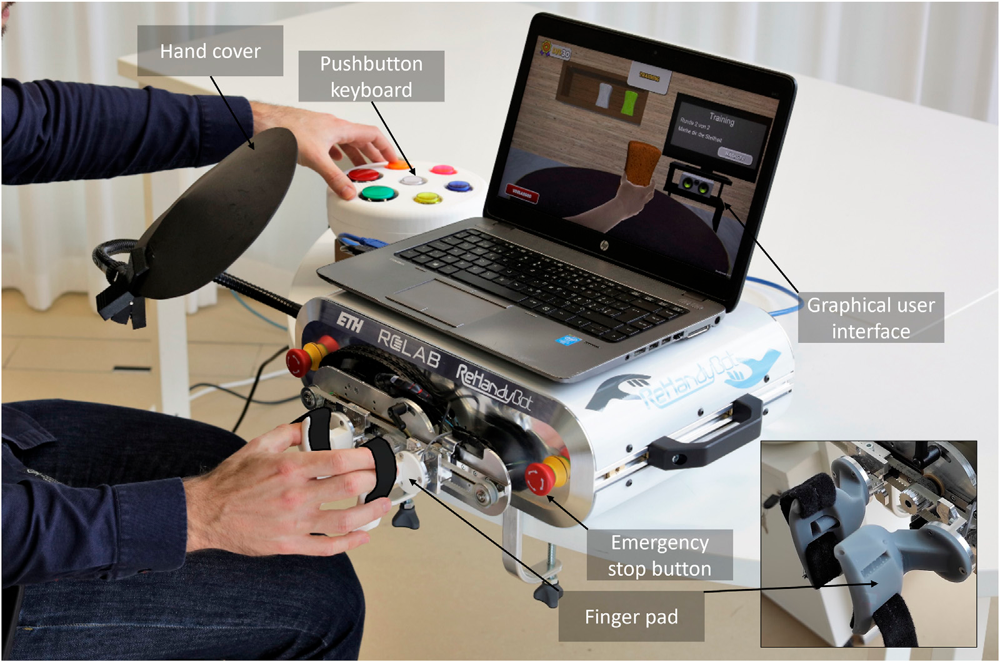
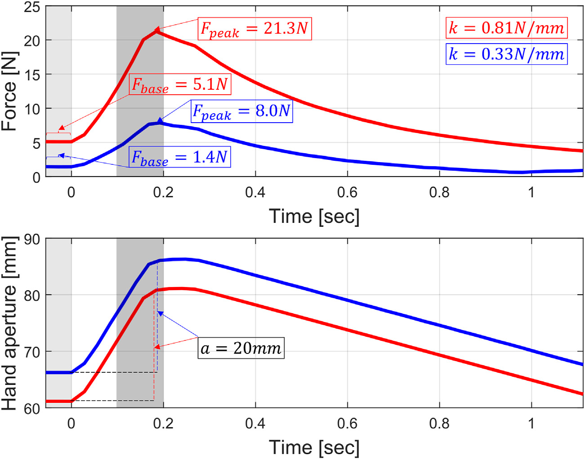
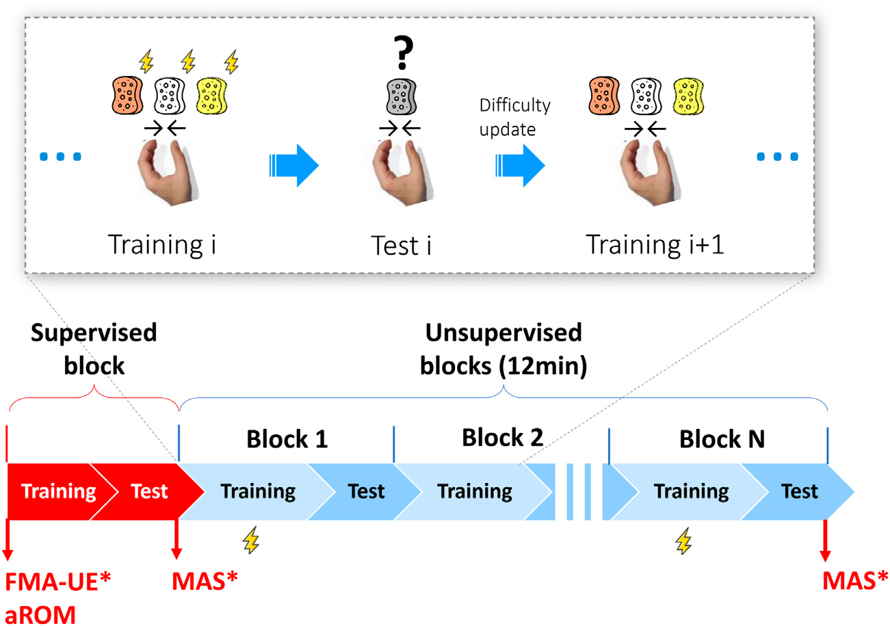
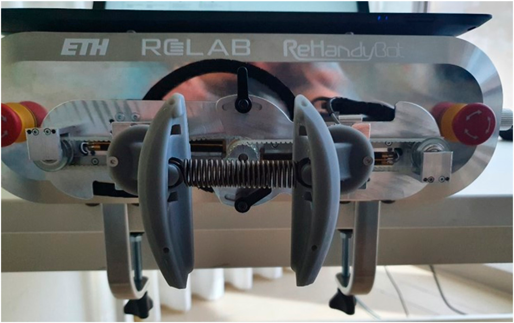
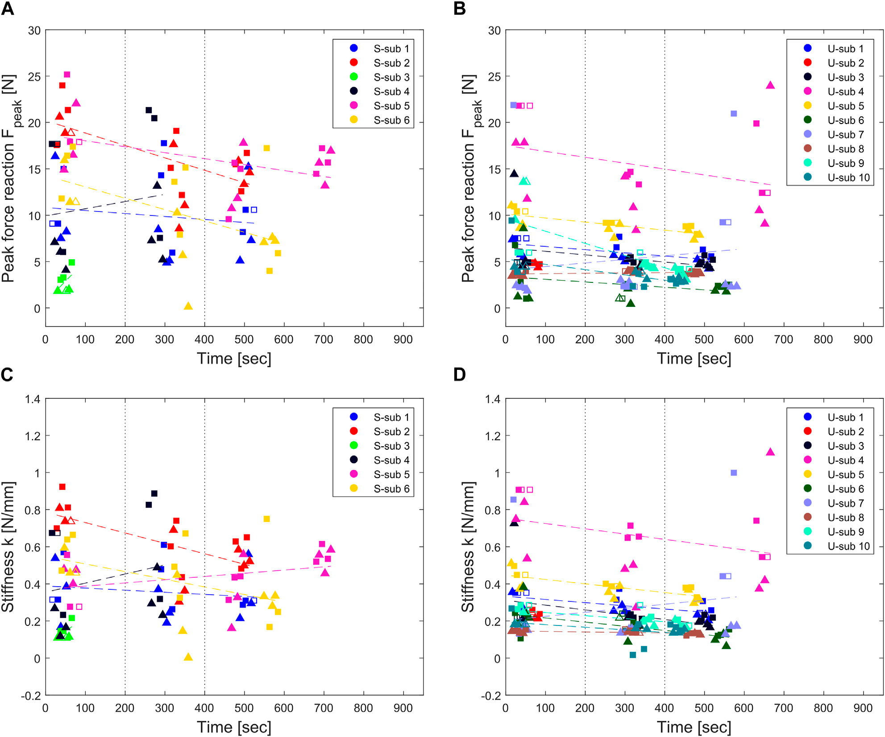
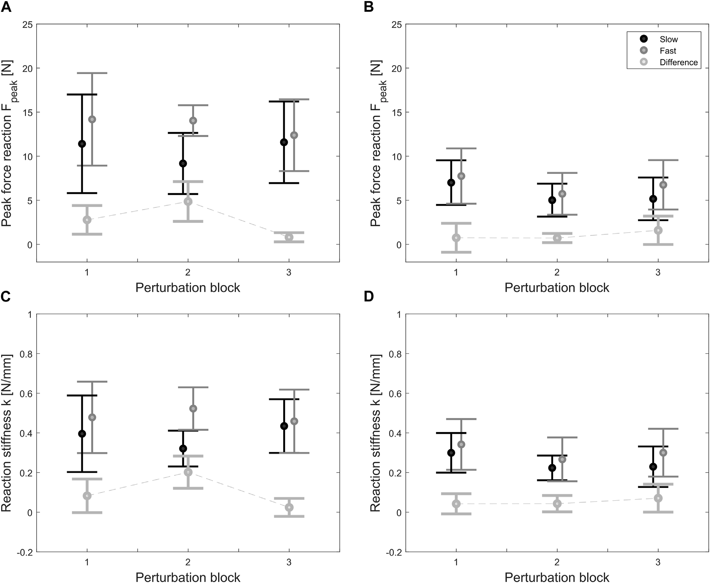

# Hand Muscle Tone Monitoring in Robot-Assisted Rehabilitation
### *Notes on Ranzani et al., Frontiers in Robotics and AI (2023)*

This paper proposes an automatic method to monitor hand muscle tone during unsupervised robot-assisted stroke rehabilitation. Using the **ReHandyBot**; a 2-DOF haptic device developed at ETH Zurich,  the system injects brief 20 mm ramp-and-hold perturbations into the patient's fingers every ~3 minutes during therapy, measuring the force response to estimate stiffness and spasticity without pausing the session. Two perturbation speeds (fast: 150 ms, slow: 250 ms) capture both the spinal and transcortical reflex arcs. In a pilot study of 6 stroke patients and 10 unimpaired subjects, stroke patients showed roughly 2× higher fingertip reaction forces (13.7 N vs. 6.8 N), with zero adverse events and muscle tone remained stable or decreased over the session, easing concerns about intensive unsupervised exercise.

What makes this work significant is that it embeds safety monitoring *inside* the therapy rather than alongside it. No therapist, no interruption, no separate assessment, the robot watches continuously. The longer term vision is a closed-loop system that uses real-time tone data to automatically adapt exercise difficulty, keeping patients safe during home rehabilitation at scale.

---

| | |
|---|---|
| **DOI** | [10.3389/frobt.2023.1093124](https://doi.org/10.3389/frobt.2023.1093124) |
| **Full text** | [PubMed Central — PMC9939644](https://pmc.ncbi.nlm.nih.gov/articles/PMC9939644/) |

---

### Figures from the Paper

| | |
|---|---|
|  |  |
| *Fig 1 — The ReHandyBot device in use* | *Fig 2 — Force trace during perturbation: stroke (red) vs. unimpaired (blue)* |
|  |  |
| *Fig 3 — Exercise structure & study protocol* | *Fig 4 — Spring testbench validation* |
|  |  |
| *Fig 5 — Individual tone measurements over session* | *Fig 6 — Average results per perturbation block* |

---

> *All figures © Ranzani et al. (2023), published open access under [CC-BY 4.0](https://creativecommons.org/licenses/by/4.0/).*
